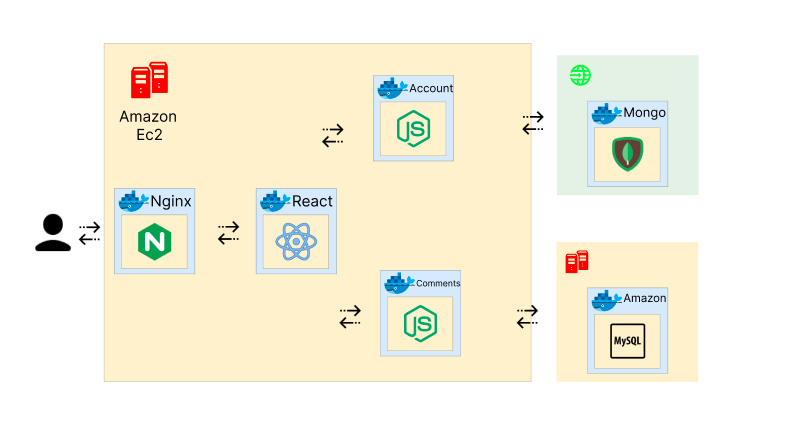

# Projeto-de-Desenvolvimento-Web-2

## ✨ Sobre o projeto

<h4>Site de visualização de vídeos de diversos jogos (clipes), com possibilidade do usuário já cadastrado comentar, dar like e fazer upload de vídeos, trocar foto do perfil, alterar nome de usuário, seguir outros usuários, como também poder compartilhar.</h4>

## 📌 Objetivos: 

- [ ] interface geral
- [ ] cadastro com email
- [ ] like, comentário(editar e apagar) e compartilhar 
- [ ] alterar nome de usuário e foto.

## ⚙️ Configuraçõs do projeto
Antes de iniciar o projeto deve ser feita algumas configurações

1-) Configuração do banco de dados:
- Deve ser criado um arquivo .env dentro do arquivo .env ficara a url de conexão 
       
        - CONNECT_STRING = String de conexão mongodb
    

## 🚀 Como Iniciar o projeto? 

#### Instalando as dependências 
    - npm install 

#### Rodando o projeto 
    - npm start

## estrutura do projeto 

