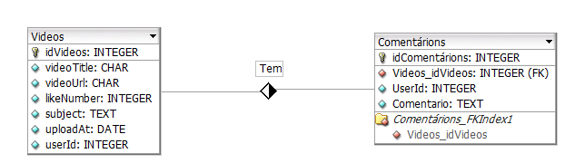

# Projeto-de-Desenvolvimento-Web-2

## ✨ Sobre o projeto

<h4>Site de visualização de vídeos de diversos jogos (clipes), com possibilidade do usuário já cadastrado comentar, dar like e fazer upload de vídeos, trocar foto do perfil, alterar nome de usuário, seguir outros usuários, como também poder compartilhar.</h4>

## 🎉Implementação na aws:
<a href='http://ec2-54-237-238-55.compute-1.amazonaws.com:3000/'>Link Amazon</a>

## 📌 Objetivos 1 unidade : 

- [ ] interface geral
- [x] Cadastro com email
- [x] Adicionar/excluir comentarios
- [x] Adicionar Videos / excluir 
- [x] Alterar nome de usuário e foto.
- [x] Postar videos
- [x] Authenticação via Jwt Token

## 📌 Objetivos 2 unidade : 

- [x] Login via redux
- [x] Adicionar loading
- [x] Implementação de cache
- [x] Implentação na Amazon
- [x] Refatorar rotas do axios
- [x] Adicionar validaçao de formularios no frontEnd
- [ ] Mandar email ao se cadastrar
- [ ] Adicionar like e favoritos
- [ ] CI/CD
- [ ] Authenticação Oauth

## ⚙️ Configuraçõs do projeto
Antes de iniciar o projeto deve ser feita algumas configurações

1-) Configuração do banco de dados(Mongodb):
- Deve ser criado um arquivo .env dentro do arquivo .env ficara a url de conexão 
       
        - CONNECT_STRING = String de conexão mongodb

2-) Configuração do banco de dados(mySql):
- no arquivo db.ts deve ser posto as configs do seu banco de dados 
       
        - 'DatabaseName',
        'User',
        'Password',{
        dialect:'mysql',
        host:'link/localhos', // O local onde esta o banco
        port:numeroDaPorta
    }   
    

## 🚀 Como Iniciar o projeto? 

#### Instalando as dependências 

Após o projeto ser baixado deve ser feita a instalação dos pacotes nas pastas (comments,user,frontEnd ) com o comando abaixo.

    - npm install 

Alem do comando acima deve ser rodado o comando abaixo nas pastar user e comments para que os arquivos .ts sejam transformados em javascript

    - npx tsc

## Rodando o projeto Com docker composer 
Depois de todas as configs vamos iniciar o docker composer:

    - docker-compose up --build -d

Após isso nosso projeto ja deve estar executando na porta 3000

## Estrutura do projeto 

## Estrutura do banco de dados sql 

